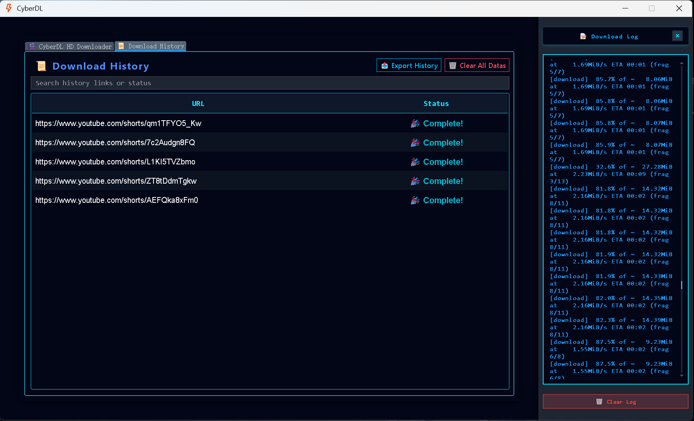

<div align="center">

<h1>CyberDL</h1>

<p><strong>A Modern GUI with subtle cyberpunk aestheticsVideo Downloader powered by yt-dlp</strong></p>

<p>
<a href="./README.md">English</a> |
<a href="./README-CN.md">简体中文</a>
</p>

<p>


</p>

</div>

---

## ✨ Overview

**VideoMergeX** is a modern desktop video downloader built on top of **yt-dlp**.  
It is designed to provide a **stable, controllable, and fully local** video downloading experience
with a clean and user-friendly GUI.

The project focuses on:
- Reliability and transparency
- Fine-grained control over download behavior
- Practical desktop usability instead of browser-based tools

It is suitable for both casual users and advanced users who require batch processing,
cookie control, and multi-resolution downloads.

---
## 📸 Screenshots

### Batch Download Mode


### Single Download Mode


### History Records



## 📋 Features

### 🎯 Core Features
- **Multi-platform Support**  
  Powered by yt-dlp, supporting YouTube, TikTok, Bilibili, and many other websites
- **Smart Cookie Management**  
Automatic browser cookie extraction  
Manual cookie file import
- **Multiple Resolution Options**  
  Supports `best / 1080p / 720p / 480p / 360p`
- **Batch Downloading**  
  Add multiple URLs and process them simultaneously
- **Real-time Progress Monitoring**  
  Table-based task management with clear status indicators
- **Download History Tracking**  
  Automatically saves download history for later reference
- **Multi-language Interface**  
  One-click switching between English and Chinese

---

## 📁 Project Structure
```

VideoDownloader/
├── main.py                   # Main program entry
├── downloadWorker.py         # Download worker threads
├── historyManager.py         # History record management
├── logSyntaxHighlighter.py   # Log syntax highlighting
├── translate_data.py         # Multi-language translation data
├── style.qss                 # Interface stylesheet
├── history.qss               # history stylesheet
├── icon.ico                  # Application icon
├── cookies/                  # Cookie file storage directory
├── requirements.txt          # Python dependencies list
└── README.md                 # Project documentation
```
## 🚀 Quick Start

### Requirements
- **Python 3.11+** 
- **Windows 10/11** (Linux/macOS requires testing)
- **Disk Space**: At least 100MB available space

### Installation & Running
```bash
# 1. Clone repository
git clone https://github.com/yourusername/VideoDownloader.git
cd VideoDownloader

# 2. Create conda environment and activate it(recommended)
conda create -n VidMergeX python=3.11

conda activate VidMergeX

# 3. Install dependencies
pip install -r requirements.txt

# 4. Run application
python main.py
```

### Packaging Executable
```bash
pyinstaller --onefile --windowed --clean --icon=icon.ico --name VideoDownloader main.py
```
### 🍪 How to Obtain Cookies

**Method 1: Browser Extension (Recommended)**

1. Log in to the target website using your browser.
2. Install a cookie export extension such as:
  Chrome / Edge: *Get cookies.txt*
  Firefox: *cookies.txt*
3. Open the target website page.
4. Export cookies as a `cookies.txt` file.
5. Manually import the file into the application.

This method provides the highest compatibility and stability.

**Method 2: Automatic Browser Extraction (Optional)**

The application can attempt to automatically extract cookies from supported browsers.
Administrator privileges are required, and compatibility depends on browser versions.
If extraction fails, the application will automatically fall back to cookie-less mode.

### 🛠️ Cookie Usage Notes

Manual cookie import is strongly recommended to ensure reliable access to member-only or restricted videos. While running the application with administrator privileges allows automatic cookie extraction from supported browsers, this functionality is limited to certain older browser versions due to browser security restrictions. If extraction fails, the application will automatically fall back to cookie-less download mode.

### ⚠️ Disclaimer

> This project is intended for **educational and personal use only**.
>
> The author does **not encourage or support** downloading copyrighted content without permission.
>
> Users are solely responsible for how they use this software and for ensuring compliance with **local laws, regulations, and the terms of service** of the target platforms.
>
> The author shall **not be held liable** for any misuse, data loss, or legal issues arising from the use of this project.


